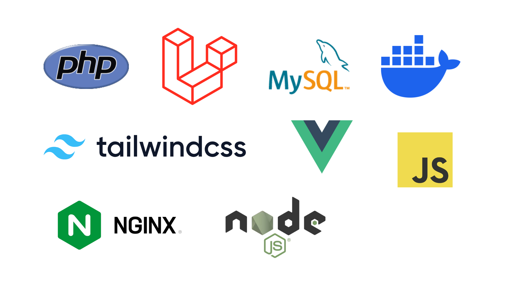

# 食材管理アプリ

このアプリは、冷蔵庫の中身を管理するシステムです。
いつの間にか期限切れになっちゃった！という事態を防ぎます。

## 主な機能

- 食材の登録／更新／削除
- 食材の賞味期限・消費期限の管理
- 期限に基づく使ったほうがいい食材のレコメンド

## 技術スタック



## セットアップ手順（Docker使用）

1. リポジトリをクローン

```bash
git clone https://github.com/urumilk/food-management.git
cd food-management
```

2. .env の作成

```bash
cd app
cp .env.example .env
```

3. コンテナの起動

```bash
cd ../infra
docker compose up -d --build
```

4. Laravelアプリの初期セットアップ（バックエンド）

```bash
docker compose exec app composer install
docker compose exec app php artisan key:generate
docker compose exec app php artisan migrate
```

5. フロントエンドの初期セットアップとビルド     
※ このアプリは Vite を使用してフロントエンドを構築しています。
```bash
docker compose exec app npm install
docker compose exec app npm run build
```

6. （任意）シーディングデータの投入

```bash
docker compose exec app php artisan db:seed
```
## ローカル環境でのアクセス
http://localhost:8888

※ ポート番号は `infra/docker-compose.yml` にて設定しています。
`infra/` ディレクトリはGit管理対象外です。

## 今後の実装予定
- 食材カテゴリ
- 価格の登録と食費計算
- カロリーや栄養素の計算
- 買い物リスト機能
- レシピ検索
- 今ある食材で作れるレシピをレコメンド


